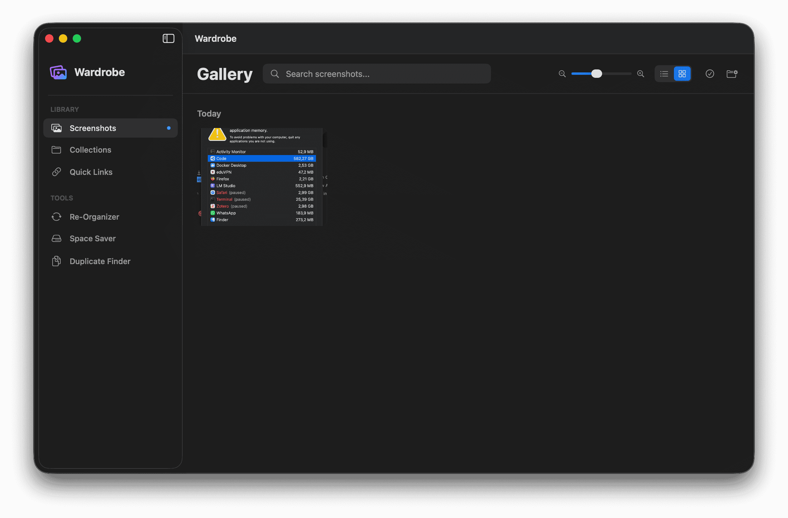

# Wardrobe - macOS Semantic Screenshot Organizer

[](https://github.com/rashomon-gh/Wardrobe/actions/workflows/build.yml) [](https://github.com/rashomon-gh/Wardrobe/actions/workflows/release.yml)

A privacy-first, local macOS menubar application that organizes and searches screenshots using Optical Character Recognition (OCR) and semantic embeddings. All processing happens on-device with zero external API calls.

## Screenshot



## Features

- **Drag & Drop Integration**: Simply drag screenshots into the menubar app to organize them
- **OCR Processing**: Automatically extracts text from images using Apple's Vision framework while preserving columnar layouts
- **Semantic Search**: Natural language search powered by Apple's NaturalLanguage framework
- **Entity Extraction**: Automatically identifies and structures key information like dates, organizations, and tracking numbers
- **Privacy-First**: All data stored locally, no cloud processing
- **Quick Look Preview**: Click on images to preview them in full size

## Technology Stack

- **Language**: Swift 5.9+
- **UI Framework**: SwiftUI (macOS 14+)
- **Data Persistence**: SwiftData
- **OCR**: Vision Framework (VNRecognizeTextRequest)
- **Semantic Embeddings**: NaturalLanguage Framework (NLEmbedding)
- **Search Algorithm**: Cosine Similarity for vector comparisons

## Architecture

### Data Flow

1. **Ingestion**: User drags images into the menubar drop zone
2. **Storage**: Images are saved to `~/Documents/Wardrobe/Images/`
3. **Processing**: 
   - Vision framework extracts and structures text from images based on their visual layout
   - NaturalLanguage framework generates semantic embeddings and performs Entity Recognition (Organizations, People, Dates, etc.)
4. **Persistence**: Metadata, structured OCR text, extracted entities, and embeddings stored in SwiftData
5. **Retrieval**: Search queries are vectorized and compared using cosine similarity

### Core Components

#### Models
- `ImageRecord`: SwiftData model storing image metadata, OCR text, extracted entities, and embeddings

#### Services
- `StorageManager`: Handles file operations and image storage
- `ProcessingService`: Manages OCR and embedding generation
- `SearchService`: Performs semantic search with cosine similarity

#### Views
- `MenuBarView`: Main menubar interface
- `SearchBarView`: Search input field
- `DropZoneView`: Drag-and-drop area for images
- `ImageGridView`: Displays search results in a grid
- `ImageThumbnailView`: Individual image preview with similarity score

## Usage

1. Launch the app - it appears in the macOS menubar
2. Drag and drop screenshots onto the drop zone
3. The app automatically processes each image (OCR + embedding generation)
4. Type a natural language query to search through your images
5. Click on any result to preview the full image

## Search Examples

- "database schema"
- "error message about timeout"
- "pricing page with plans"
- "dashboard showing analytics"
- "API documentation"

## Installation

```bash
brew tap rashomon-gh/tap
brew install --cask wardrobe
```


## Requirements

- macOS 14.0 or later
- Xcode 15.0 or later

## Development Notes

- The app runs in the background/menubar (LSUIElement = YES)
- All ML processing uses Apple's native frameworks (Vision, NaturalLanguage)
- Concurrency is handled using Swift's async/await and actors
- Vector operations are optimized for performance

## Privacy

- Zero external API calls
- All data stored locally on your Mac
- No internet connection required for processing
- Images stored in standard Documents directory

